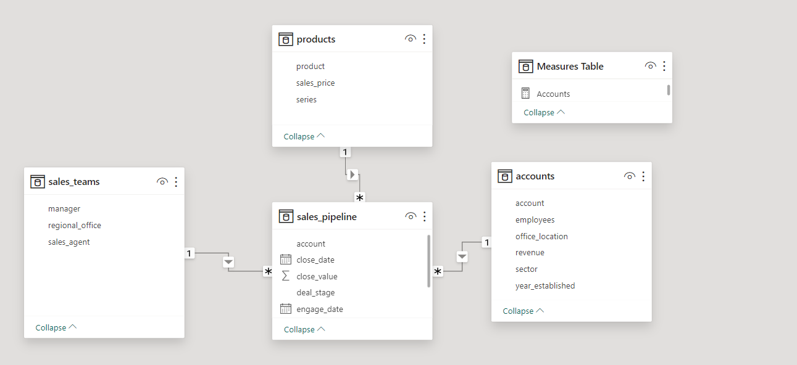
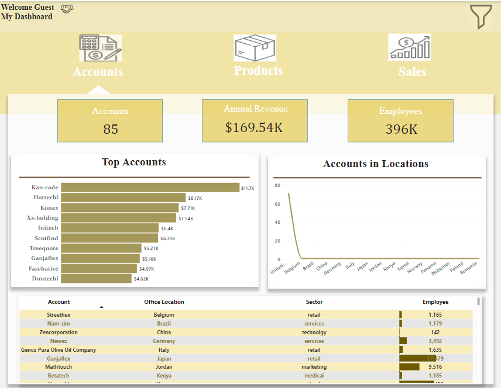
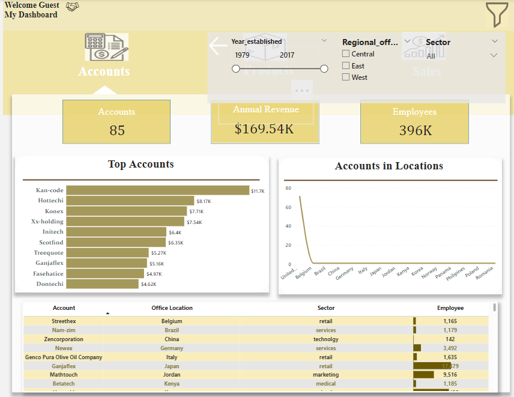
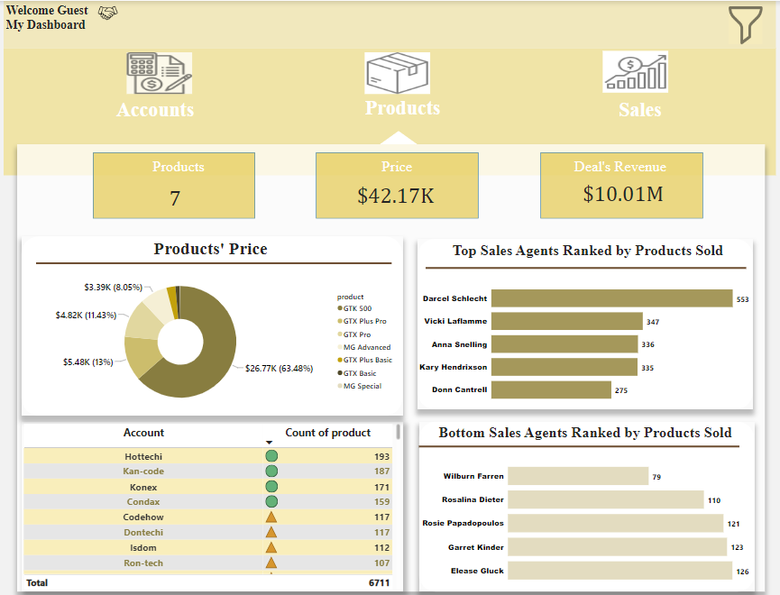
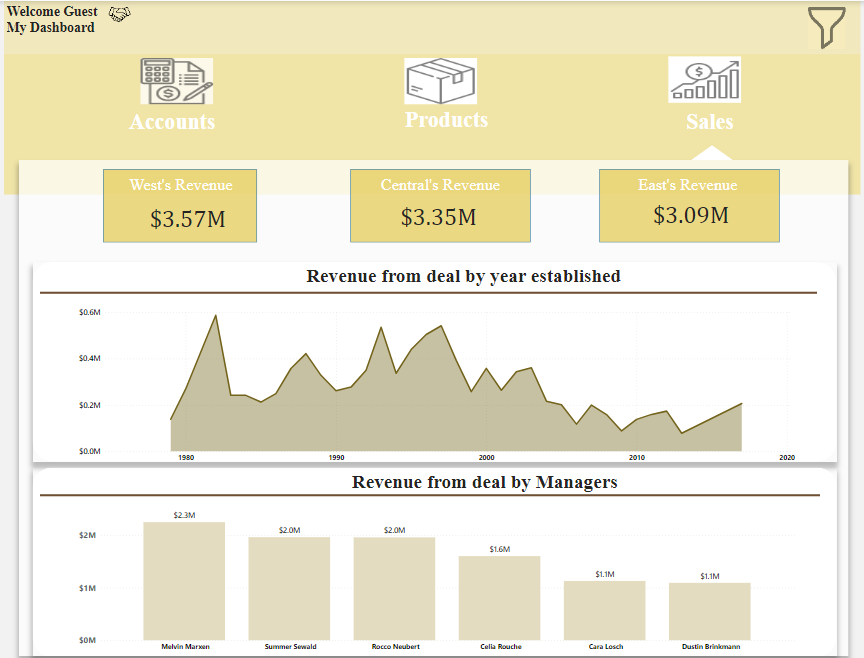

# CRM-sales-Analysis

# Introduction
B2B sales pipeline data from a fictitious company that sells computer hardware, including information on accounts, products, sales teams, and sales opportunities.

# Problem Statement
1. What account is most thriving? What were the products purchased?
2. How many accounts were opened in the different branches?
3. What sales agent sold the most products? And what sales agent sold the least?
4. What was the revenue acquired from the deals since established over time? What manager racked in the most revenue?

# Data Source
This data was gotten from the Maven Analytics playground. Here is the (link) https://mavenanalytics.io/data-playground?search=crm%20sales%20opportunities for your reference. It contains 4 tables.

1.Account table with 85 rows and 6 columns.

2.Product table with 7 rows and 3 columns

3.Sales pipeline table with 6,711 rows and 8 columns

4.Sales team table with 35 rows and 3 columns

# Data Cleaning
Data cleaning was performed using power query. Columns with missing values were removed, others were filled.

# DAX Formula
I created a measures table using the Enter data from the home tab. There I housed all my measures for more efficiency and easy access to my measures. Functions used includes, COUNT, SUM AND CALCULATE.

# Data Modelling

----

# Data Visualization
The visualization is a three page report. comprises of an executive dashboard with a hidden filter pane, produt dashbaord and a map for navigation. You can interact with the visualization (https://app.powerbi.com/view?r=eyJrIjoiYjVmYWRmMDAtODAxNy00M2ZmLTkxMTctYmRhNzc2MTU1MTFkIiwidCI6ImUyODE5OGNhLTExOWQtNDhmOC1iYzBlLTczMzIxYTM4YzJlMyJ9)

# Accounts 
Accounts                  | Accounts with filter
:------------------------:|:---------------------:
         | 
---                         

# Product

---

# Sales

---

# Insisghts
1. Kan-code was the top accounts, followeed by Hottechi. Hottechi(193) still purchased more products compared to Kan-code(187).
2. United states has 71 accounts,whilst other countries had one accounts each. Which is relatively poor.
3. Kan-code being a software sector has the most number of employees with 34,288.
4. GTK 500 is the most expensive product($26,768) amongst other products.
5. Darcel Schlecht is the most resourceful sales agent with 553 sales. And the least resouceful agent is Willburn Farren with 79 sales.
6. Manager Melvin Marxen racked in the most revenue from deal with a whopping sum of $2.25M, whilst the least revenue generated was made from Manager Dustin Brinkmann.
   
